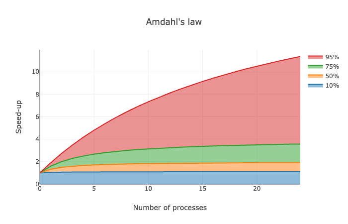

### Amdahl's law

It's just my playground with Amdahl's law. I know that this law realization as code thoroughly has been written many and many times, but I decided to do it myself as research and learning.
I've written several useful methods for computing desired values
1) `speedUpRate` - Calculates how fast will your system with a specific number of processes, and with some proportion of parallel computing
2) `drawPlot` - Draws graph with plots. Pass into the method: 1) number of processes/threads 2) Sequences with values of parallel percentage (To compare with each other)

3) `calculateSerialProportion` -
   It's something new... I was wondering I have no clue where and how I should know how many serial/parallel works have some computing.\
   However, I could gather a processing time, and change the number of threads(as an example).\
   With this knowledge now we can determine how much serial processing proportion **we have, and aim to reduce it**. The method returns the most effective number of processes.
   This method takes Tuple(processing time, number of processes). More values, better and precise output.

There's my attempt at modeling parallel work: `src/main/scala/SomeApp.scala` 